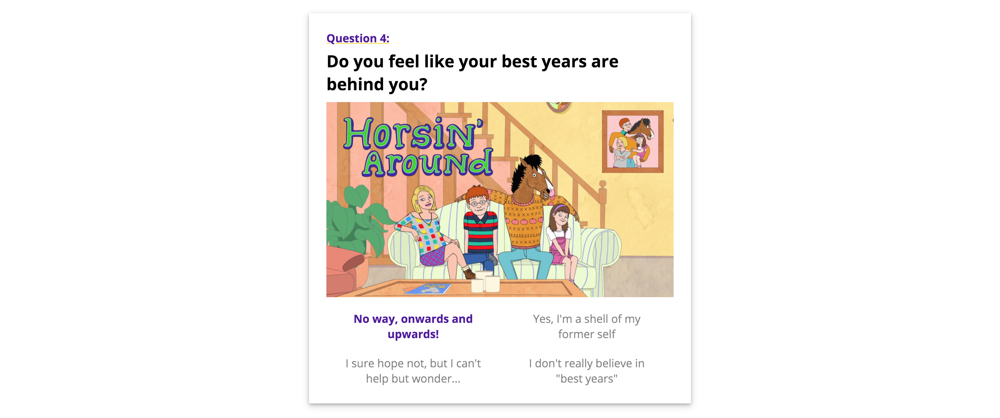
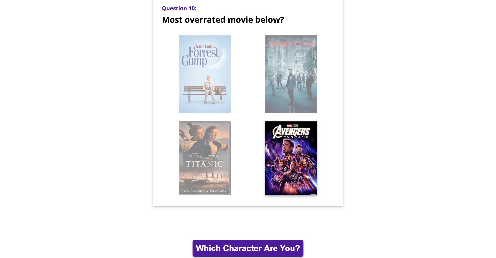

# CS52 Lab 2: Which Bojack Horseman Character Are You?

## Resubmit note

Just updated this for my resubmit. I didn't change too much; the biggest difference is that I figured out how to add a non-selected state (which makes it look a lot better in my opinion). This also solved the problem of having no selected state for the image question. 

## Overview

For this project, I built a Buzzfeed style quiz to determine which character you are most similar to from the show Bojack Horseman. The closest inspiration for the style of my page was this (from The Quiz), https://www.thequiz.com/which-bojack-horseman-character-are-you/ (which has a similar structure of question, image, answer choices). However, I like the style and content of my own page a lot more, and it's quite different. 

My quiz has 10 questions with 4 answer choices each, and the calculation of the results is a bit complicated because there are 5 characters, and a lot of the answer choices apply to multiple characters. The calculation is still pretty simple - if the answer choice applies to a given character, I increment their index in an array, and the index with the highest value determines which character you are. However, I couldn't think of a way to implement this other than by using a LOT of if-statements. It works well and the page loads quickly, but I suspect there has to be a better way to do this.  

I'm very happy with the structure of my page and I really enjoyed coming up with the content for this lab. Here's my deployed url: [deployed url](https://dartmouth-cs52-20x.github.io/lab2-quizzical-jeremy-washam/)

## Citations

Every resource I used for this project is cited in comments in my code, but I figured I would list them here as well.
<ul>
  <li>I used this for the modal (html, css, and js): https://www.w3schools.com/howto/howto_css_modals.asp</li>
  <li>I found the css box shadow effect that I used throughout the project here: https://www.w3schools.com/css/css3_shadows_box.asp</li>
  <li>I used this to figure out how to scale the item on hover: https://travis.media/how-to-make-an-item-grow-on-hover-with-css/ </li>
  <li>I used this function to determine the index of the max value in an array (used when I determine the winner) https://stackoverflow.com/questions/11301438/return-index-of-greatest-value-in-an-array </li>
  <li>And finally, all of the images that I used for this project were from Google Images, and of course were originally from the show Bojack Horseman.</li>
</ul>

## Reservations
<ul>
  <li>I didn't get a change to try loading in the questions from a JSON file</li>
  <li>I would like to have a cooler modal transition effect, but I couldn't figure out how to implement any of the ones I found online.</li>
  <li>I'd also like for the page to automatically scroll to the next question when you pick an answer, but I didn't have time to figure this out either.</li>
</ul>

## Screenshots
Attached here are some screenshots of my favorite elements of the lab: the header (I just think it looks good), the selected option styling (it took a while but I came up with what I thought was a clever way to change the font weight of the selected answer without any of the words wrapping into the next line), the submit button, and the modal.

